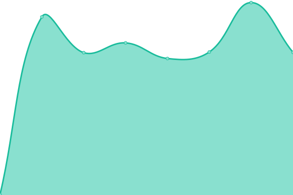
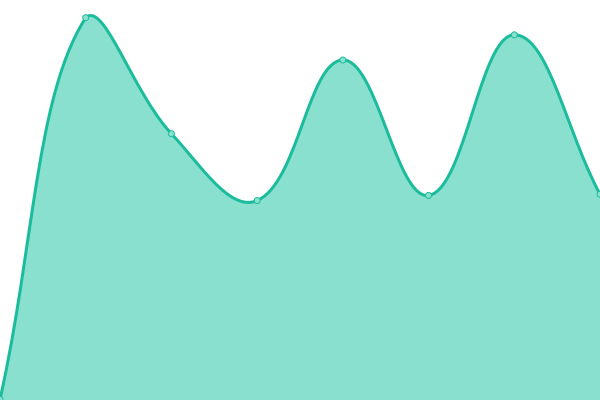
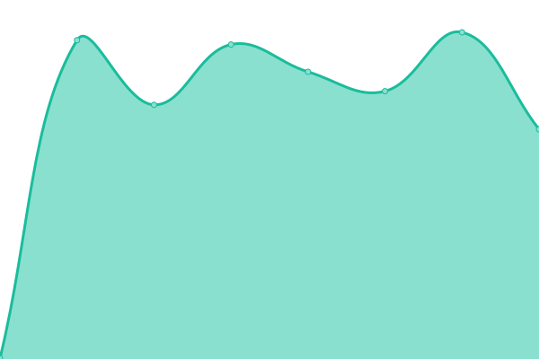

# [📈 Live Status](https://poldracklab.github.io/uptime): <!--live status--> **🟩 All systems operational**

This repository contains the open-source uptime monitor and status page for [poldracklab](https://poldracklab.github.io/uptime), powered by [Upptime](https://github.com/upptime/upptime).

With [Upptime](https://upptime.js.org), you can get your own unlimited and free uptime monitor and status page, powered entirely by a GitHub repository. We use [Issues](https://github.com/poldracklab/uptime/issues) as incident reports, [Actions](https://github.com/poldracklab/uptime/actions) as uptime monitors, and [Pages](https://poldracklab.github.io/uptime) for the status page.

<!--start: status pages-->
<!-- This summary is generated by Upptime (https://github.com/upptime/upptime) -->
<!-- Do not edit this manually, your changes will be overwritten -->
<!-- prettier-ignore -->
| URL | Status | History | Response Time | Uptime |
| --- | ------ | ------- | ------------- | ------ |
|  [OpenfMRI](https://openfmri.org) | 🟩 Up | [openf-mri.yml](https://github.com/poldracklab/uptime/commits/HEAD/history/openf-mri.yml) | 

 447ms
     
 | 

<a href="https://poldracklab.github.io/uptime/history/openf-mri">100.00%</a>
    

|  [Cognitive Atlas](https://cognitiveatlas.org) | 🟩 Up | [cognitive-atlas.yml](https://github.com/poldracklab/uptime/commits/HEAD/history/cognitive-atlas.yml) | 

 453ms
     
 | 

<a href="https://poldracklab.github.io/uptime/history/cognitive-atlas">100.00%</a>
    

|  [NeuroVault](https://neurovault.org) | 🟩 Up | [neuro-vault.yml](https://github.com/poldracklab/uptime/commits/HEAD/history/neuro-vault.yml) | 

 493ms
     
 | 

<a href="https://poldracklab.github.io/uptime/history/neuro-vault">100.00%</a>
    

|  [Experiment Factory](https://expfactory.org) | 🟩 Up | [experiment-factory.yml](https://github.com/poldracklab/uptime/commits/HEAD/history/experiment-factory.yml) | 

 406ms
     
 | 

<a href="https://poldracklab.github.io/uptime/history/experiment-factory">100.00%</a>
    

<!--end: status pages-->

[**Visit our status website →**](https://poldracklab.github.io/uptime)

## 📄 License

- Powered by: [Upptime](https://github.com/upptime/upptime)
- Code: [MIT](./LICENSE) © [poldracklab](https://poldracklab.github.io/uptime)
- Data in the `./history` directory: [Open Database License](https://opendatacommons.org/licenses/odbl/1-0/)
